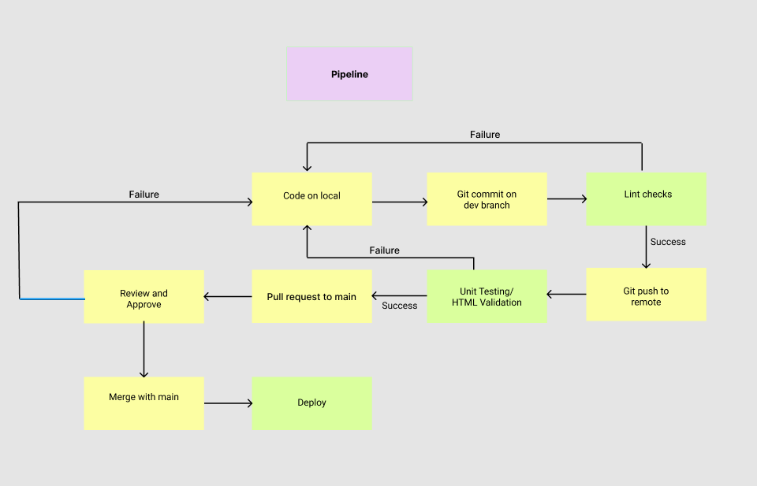

# Build Pipeline Phase 1 

---

## Grunt 
We are using grunt in order to automate a variety of processes in the build pipeline. For now the two important ones are: linting with JSHint and automated documentation generation using JSdocs.
 
The Gruntfile and package.json with all the necessary dependencies are included within the source directory. When running the gruntfile it selects all .js files inside the directory `/source/assets/` and runs JSHint lint checking on all the files found. It also runs JSDocs automated documentation generation on these files. 

### How to Set Up Grunt
1. Ensure that you have the latest version of `npm` installed by running `npm update -g npm` anywhere in your terminal
2. Install Grunt CLI by running `npm install -g  grunt-cli`
3. Use `cd` to get back to the root directory (optional if you are already in the root directory)
4. Navigate to the source directory with `cd source`
5. Once you are in the source directory run `npm install` to install all the dependencies in package.json
6. Congratulations, you've sucessfully set up grunt.

### How to use grunt
Using grunt is very simple, once you are ready to autogenerate documentation and run lint checking just run the `grunt` command directly in terminal. It will let  you know if there are any lint-related errors with your JS code and generate the documentation. The documentation will be stored within the `source/doc` directory. In order to see the generated documentation go to `global.html` and use the LiveServer vscode extension in order to see the generated documentation.

---

## Linting (In CI/CD Pipeline)
We are using grunt in order to incorporate the linting process directly into the build pipeline. JSHint will be used for code stle enforcement, all members of the team are expected to make sure that all JS code follows the linting guidelines before the commits are pushed into their respective branches. During a pull request the reviewer may also use the `grunt`  command to make sure that style guidelines are followed before approving of the merge request. 
 
After running `grunt` the terminal shoud output something like:
> 2 files lint free.

## Autogenerating Documentation 
We aer using JSDocs in order to generate documentation. In order for JSDocs to work properly you must follow these guidelines:

1. All .js file are within `source/assets/`
2. Grunt must be installed and set up sucessfully (see above)
3. You must comment your code according to JSDocs guidelines linked [here](https://jsdoc.app/about-getting-started.html)

If all the above steps are followed then you can autogenerate the documentation for the webapp. In terms of team expectations, this is the identical to the linting process described above. After you have developed your code on your local branch, you are expected to run `grunt` before pushing your changes to the remote branch. This is an important part of the build pipeline.

## Code Quality via Human Review (Pull Requests)
After you have finished making your changes locally, sucessfully passed the appropriate linting and documentation generation  tasks using Grunt, you can push your changes the remote branch. At this point you can make a pull request. Pull requests have been set up to require manual review from one of your team members before anything can be merged into main. This is to ensure the code quality remains high. 

## Unit Tests
Work In Progress

## Code Quality via Tool
Work in Progress
